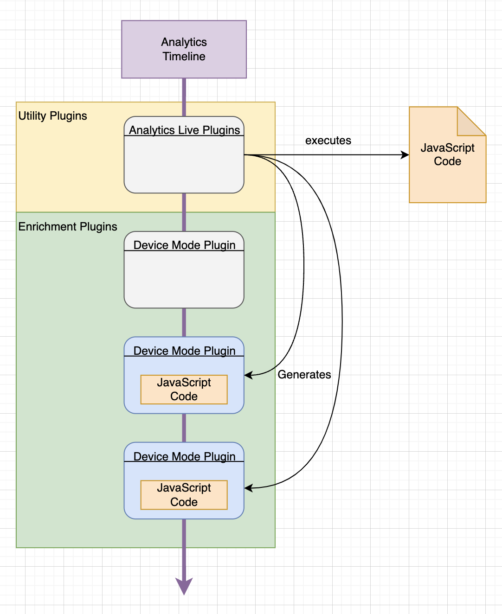

# Analytics Live for Swift

Analytics Live allows you to execute JavaScript stored in your workspace that 
can create on-device Plugins that work just like regular on-device Plugins.



When you install the Analytics Live Plugin it can download a file containing
JavaScript instructions that are used to create one or more on-device Plugins.

These plugins can then modify an event in the timeline like a regular on-device
plugin.

## Getting Started

Add the LivePlugins plugin to your Analytics instance

```swift
import Segment
import AnalyticsLive

...

let config = Configuration(writeKey: "WRITEKEY")
            .flushAt(1)
            .trackApplicationLifecycleEvents(true)

analytics = Analytics(configuration: config)

analytics.add(plugin: LivePlugins(fallbackFileURL: nil)
```

Note: A `fallbackFileURL` can be provided if you want a default file to be
available at first start up or no file is configured in your space.

See the [LivePluginExample](Examples/LivePluginExample/) project for a example 
on how to do this.

For more on uploading the Analytics Live Plugin file see the [segmentcli](https://github.com/segment-integrations/segmentcli/) repo. 

## JavaScript API

### Utility Functions
```javascript
/*
Log a message to the native console
*/
console.log(message)
```

### Pre-defined Variables
```javascript
/*
  This analytics pre-defined value represents the instance of the Analytics
  class running in your native application.
*/
let analytics = Analytics("<YOUR WRITE KEY>")
```

### Exposed Native Classes
```javascript
// Represents the native-code Analytics class
class Analytics {
	/* 
	Create a new instance of Analytics
	Params:
		writeKey: String - The writekey this instance will send data to
	
	to-do: See if other config options make sense to expose.
	*/
	constructor(writeKey) { }

	/*
	Get the traits for the current identified user
	Returns: 
		Object/Dictionary containing the users traits
	*/
	get traits() {}

	/*
	Get the current user ID
	*/
	get userId() {}

	/*
	Get the current anonymous ID
	*/
	get anonymousId() {}

	/*
	Send a track event to segment
	Params:
		event: String - the name of the event
		properties: Object - any additional properties or null
	*/
	track(event, properties) {}
	
	/*
	Send an identify event to segment
	Params:
		userId: String - the user id
		traits: Object - any additional information about the user
	*/
	identify(userId, traits) {}
	
	/*
	Send a screen event to segment
	Params:
		title: String - The title of this screen
		category: String - The category of this screen, or null
		properties: Object - Any additional properties or null
	*/
	screen(title, category, properties) {}
	
	/*
	Send a group event to segment
	Params:
		groupId: String - The groupId to associate with this session
		traits: Object - Any additional information about this group or session
	*/
	group(groupId, traits) {}
	
	/*
	Send an alias event to segment
	Params:
		newId: String - Associate this new ID with this user as an alias.
	*/
	alias(newId) {}
	
	/*
	Resets the current session.  A new anonymousId is created.  All user identity,
	traits, etc. are removed from this analytics instance.
	*/
	reset() {}
	
	/*
	Tell this analytics instance to send any queued events off to segment.
	*/
	flush() {}
	
	/*
	Add a LivePlugin subclass to this analytics instance. The LivePlugin subclass will
	determine whether this LivePlugin should run as part of the source timeline, or
	a specific destination timeline.
	*/
	add(livePlugin) {}
}

// Represents an enum defining an live plugin type
const LivePluginType = {
	before: "before",
    enrichment: "enrichment",
    after: "after",
    utility: "utility"
};

// Represents the type of settings update being received
const UpdateType = {
	initial: true,
	refresh: false
}

// Subclass LivePlugin to add custom behaviors/transformations
class LivePlugin {
	/* 
	Create a LivePlugin
	Params:
		type: LivePluginType - The type of live plugin
		destination: String - A string representing the destination key this
							  live plugin will be active for
	*/
	constructor(type, destination) {}
	
  	/*
	Returns the LivePluginType designation for this live plugin
	*/
	get type() {}
	
	/*
	Returns the destination this live plugin is active on, or null
	*/
	get destination() {}
	
	/*
	Update is called by the system when we receive new settings from Segment
	or the Analytics system is starting up.  
	
	Implementing this method is useful
	for doing any setup that might be needed based on settings.
	
	Params:
		settings: Object - A key/value object of all settings received from Segment
		type: UpdateType - Determines if this is an initial batch of settings or a
						   subsequent update
	*/
	update(settings, type) {}
	
	/*
	When events move through the system, `process` is called.  This will naturally 
	call out to the appropriate handlers such as `track`, `identify`, etc.  If you
	want to perform transformations regardless of event type, override this method.
	
	Call `super.process()` if you'd like to preserve existing behavior of the base
	class.
	
	Params:
		event: Object - A key/value set of event data.
	
	Returns: 
		A transformed or modified event object, the original event object,
		or null if the event is to be discarded.
	*/
	process(event) {}
	
	/*
	Override this method to apply transformations specific to track events.
	
	Params:
		event: Object - A key/value set of event data.
	
	Returns: 
		A transformed or modified event object, the original event object,
		or null if the event is to be discarded.
	*/
	track(event) {}

	/*
	Override this method to apply transformations specific to identify events.
	
	Params:
		event: Object - A key/value set of event data.
	
	Returns: 
		A transformed or modified event object, the original event object,
		or null if the event is to be discarded.
	*/
	identify(event) {}

	/*
	Override this method to apply transformations specific to group events.
	
	Params:
		event: Object - A key/value set of event data.
	
	Returns: 
		A transformed or modified event object, the original event object,
		or null if the event is to be discarded.
	*/
	group(event) {}

	/*
	Override this method to apply transformations specific to alias events.
	
	Params:
		event: Object - A key/value set of event data.
	
	Returns: 
		A transformed or modified event object, the original event object,
		or null if the event is to be discarded.
	*/
	alias(event) {}

	/*
	Override this method to apply transformations specific to screen events.
	
	Params:
		event: Object - A key/value set of event data.
	
	Returns: 
		A transformed or modified event object, the original event object,
		or null if the event is to be discarded.
	*/
	screen(event) {}

	/*
	Reset is called on an live plugin when the system is told to reset.  Any
	user information should be discarded.
	*/
	reset() {}

	/*
	Flush is called on an live plugin when the system is told to send any
	queued events off to Segment.
	*/
	flush() {}
}
```

### Creating and Using Live Plugins
```javascript
// This live plugin will fix an incorrectly named event property
class FixProductViewed extends LivePlugin {
	track(event) {
		if (event.event == "Product Viewed") {
			// set the correct property to the value
			event.properties.product_id = event.properties.product_did
			// delete the misnamed property
			delete event.properties.product_did
		}
		return event
	}
}

// create an instance of our FixProductViewed live plugin
let productViewFix = new FixProductViewed(LivePluginType.enrichment, null)

// add it to the top level analytics instance.  any track events that come
// through the system will now have event.properties.product_did renamed
// to product_id.
analytics.add(productViewFix)


// This live plugin will remove advertisingId from all events going to Amplitude
class RemoveAdvertisingId extends LivePlugin {
	process(event) {
		// delete the advertisingId
		delete event.context.device.advertisingId
		return super.process(event)
	}
}

// create an instance of our FixProductViewed live plugin
let deleteAdID = new RemoveAdvertisingId(LivePluginType.enrichment, "Amplitude")
// add it to the top level analytics instance.  All events going to amplitude
// will now have the advertisingId property removed.
analytics.add(deleteAdID)


// This live plugin will reissue/convert a specific track event into a 
// screen event.
class ConvertTrackToScreen extends LivePlugin {
	track(event) {
		// if the event name matches ...
		if event.name == "Screen Viewed" {
			// issue a screen event instead
			analytics.screen(event.name)
		}
		// returning null to prevent the original event from
		// moving forward.
		return null
	}
}

// create an instance of our ConvertTrackToScreen live plugin
let convert = new ConvertTrackToScreen(LivePluginType.enrichment, null)
// add it to the top level analytics instance.  Track events matching
// the specified event name will be converted to screen calls instead.
analytics.add(convert)
```

### Using the Analytics classes within Live Plugins runtime
```javascript
// Issue a simple track call into the system.  This will 
analytics.track("My Event")

// Create a new instance of Analytics that points to a different write key
let myAnalytics = new Analytics("<ALTERNATE WRITE KEY>")
myAnalytics.track("New analytics instance started.")
```
